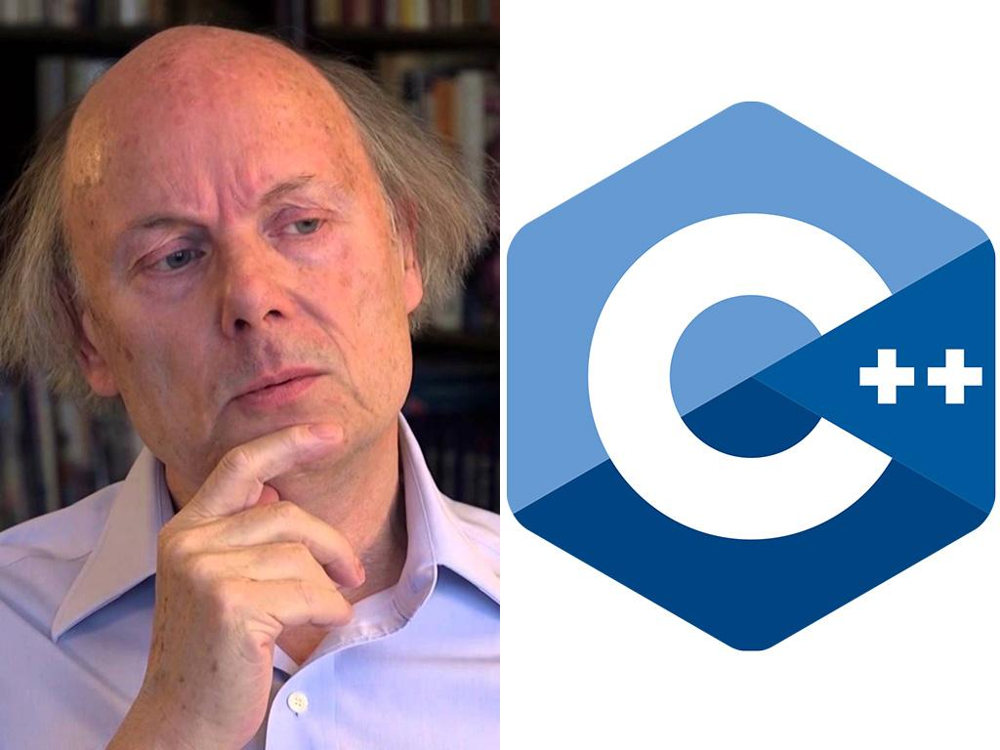

# Title

Vasia

Pety

lskjdf lskdjf   
lksdjfl

My namme is **Vasia**

My **namme** is *Vasia*

My namme is ***Vasia***

> lksjdflkj
> 
> ksdflkj
> 
> lksjdf

1. One
2. Two
3. 

- one
- two

lksdjf lksjdflj `std::cout << "hello;"; `

```js
unction myDisplayer(some) {  
  document.getElementById("demo").innerHTML = some;  
}  
  
let myPromise = new Promise(function(myResolve, myReject) {  
  let x = 0;  
  
// The producing code (this may take some time)  
  
  if (x == 0) {  
    myResolve("OK");  
  } else {  
    myReject("Error");  
  }  
});  
  
myPromise.then(  
  function(value) {myDisplayer(value);},  
  function(error) {myDisplayer(error);}  
);
```

```cpp
auto operation = []  (int a, int b,  string op) -> double {
  if (op == "sum") {
    // returns integer value
    return a + b;
  } 
  else {
    // returns double value
    return (a + b) / 2.0;
  }
};
```

```json
{
    "glossary": {
        "title": "example glossary",
		"GlossDiv": {
            "title": "S",
			"GlossList": {
                "GlossEntry": {
                    "ID": "SGML",
					"SortAs": "SGML",
					"GlossTerm": "Standard Generalized Markup Language",
					"Acronym": "SGML",
					"Abbrev": "ISO 8879:1986",
					"GlossDef": {
                        "para": "A meta-markup language, used to create markup languages such as DocBook.",
						"GlossSeeAlso": ["GML", "XML"]
                    },
					"GlossSee": "markup"
                }
            }
        }
    }
}
```

```sh
ls -la
```

[link](http://google.com)

[link][1]

[link]()




|one|two|three|
|-|-|-|
|vasia|petya|dima|

- [ ] one
- [ ] two
- [ ] three


[1]: [http://google.com]

<p style="color: red">TEST</p>


